[![IBM Cloud powered][img-ibmcloud-powered]][url-ibmcloud]
# Data Science-Lab 2
Aprende a crear un modelo en un Jupiter Notebook dentro de Watson Studio!!

**Ojo: Esta es la parte 2 de 3 de nuestro taller de Data Science.**

## 5. Importar una Jupyter Notebook:
1. Damos clic en “Add to project”.
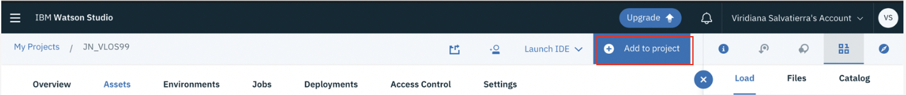
2.	Elegimos “Notebook” como “Asset Type”.
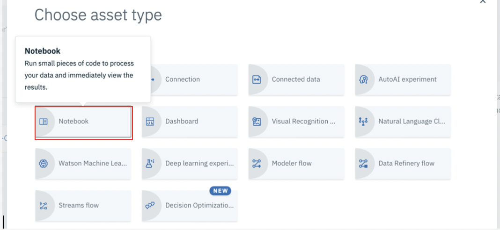
3.	Ahora seleccionamos la pestaña “From URL”. Le damos un nombre original a nuestra Jupyter Notebook, elegimos la opción “Python 3.6” en “Enviroment” y en URL pegamos la siguiente dirección: https://raw.githubusercontent.com/ibmdevelopermx/DataScience/master/notebooks/Telco-customer-churn-ICP4D.ipynb
Y damos clic en “Create Notebook”.
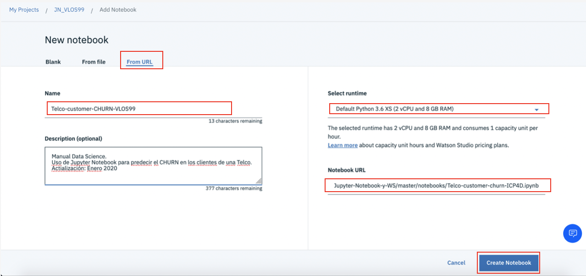
4.	Una vez que cargue nuestra Jupyter Notebook, podemos empezar a correr las celdas.
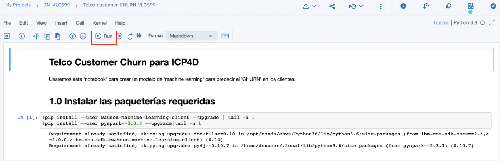
5.	Tras correr la primera, regresamos a nuestro proyecto. Seleccionamos la pestaña “Assets” y en el apartado “Notebooks”, buscamos nuestro notebook. Damos clic en el candado “Unlock notebook” y en la ventana emergente, damos clic en “Unlock”.
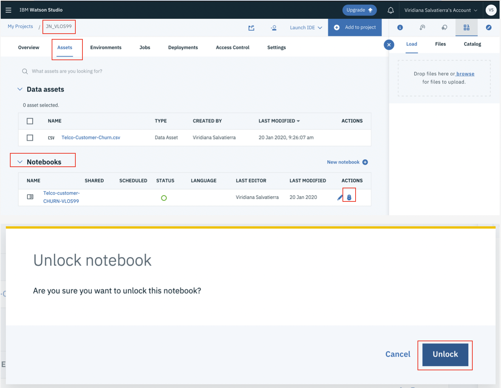
6.	Ahora damos clic en el menú de “hamburguesa” (aparece al pasar el puntero sobre él). Y seleccionamos la opción “Stop Kernel”. En la ventana emergente, damos clic en “Stop”. (Esto es para no gastar los recursos de memoria asignados a esta NOTEBOOK).
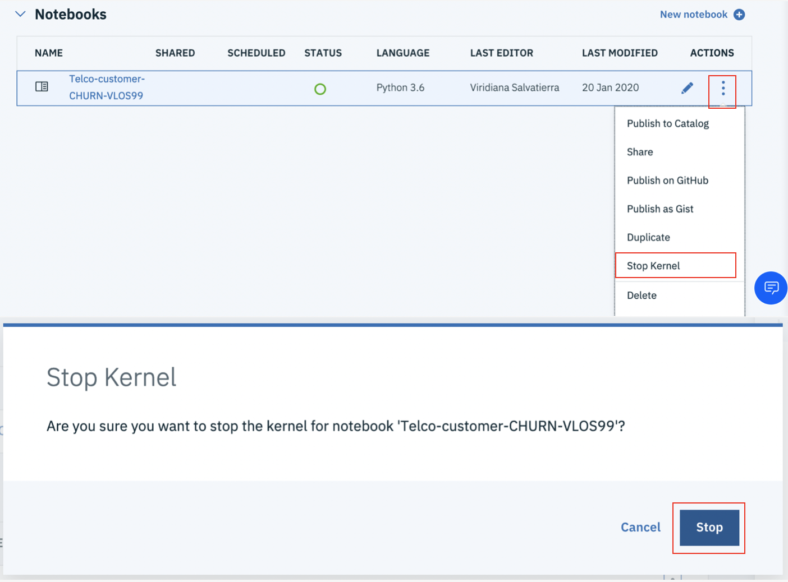
## 6. Cargar un data asset a nuestra Notebook:
1.	Damos clic en nuestra “Notebook”. Una vez dentro de ésta, damos clic en el lápiz para editar.
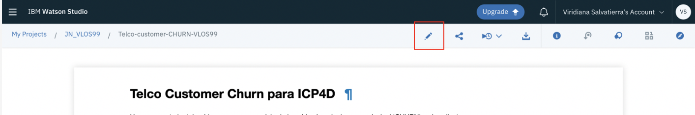
2.	Damos clic en la celda del paso 2. Ahora seleccionamos el ícono “01/00” “Find and add data” del lado superior derecho de nuestra Notebook. Da clic en la pestaña “Files”, damos clic en “Insert to code” y seleccionamos la opción “Insert pandas DataFrame”.
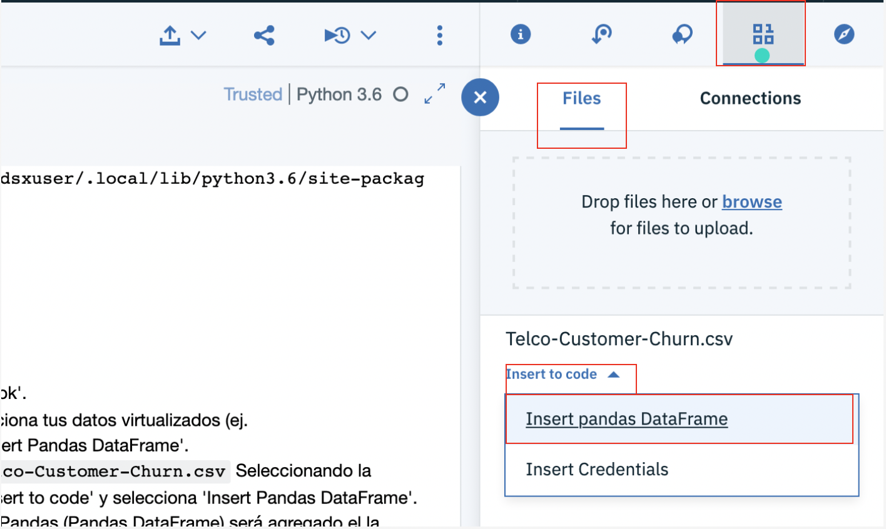
3.	Hecho esto, corremos la segunda celda. Nos daremos cuenta de que se despliega una tabla según los parámetros de la celda. 
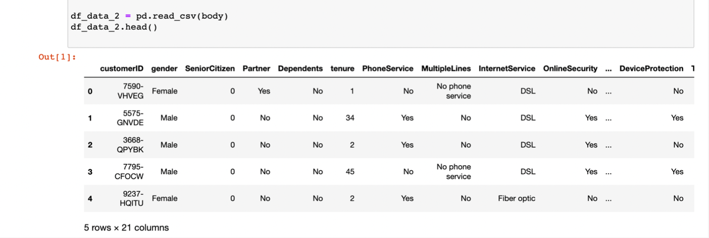
4.	Antes de correr la tercera celda, debemos asegurarnos de que la variable “n” en “df_data_n” sea igual en la segunda y tercera celdas. Ejemplo: en mi caso, el resultado del proceso de la celda 2, dio como resultado “df_data_2”, por lo que en la tercera celda, “df” debe tener asignado el valor “df_data_2”. 
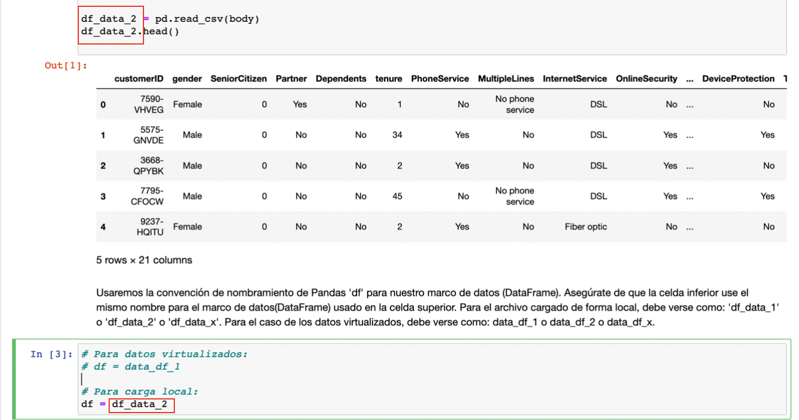
5.	A continuación, seguimos ejecutando las celdas hasta llegar al apartado 3.0 “Crear un modelo”.
## 7. Crear un modelo:
1.	En esta sección, se realiza la separación de datos de prueba y de entrenamiento. 

2.	En el apartado 3.5, se crea la “pipeline” y el modelo utilizando el algoritmo clasificador “Random Forest”.
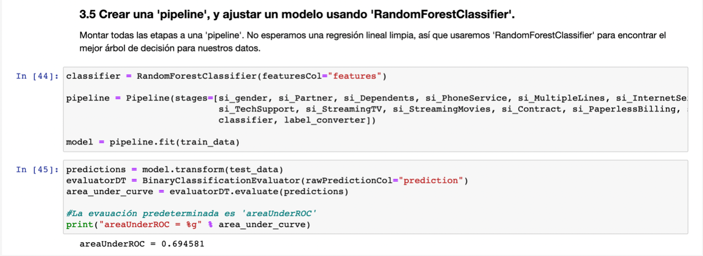
## 8. Guardar el modelo y probar los datos:
1.	Lo primero que debemos hacer, es darle un nombre fácilmente identificable a nuestro modelo. Podemos usar nuestras iniciales y un número o la fecha. 
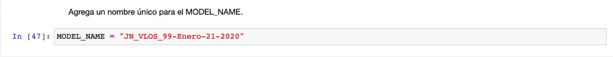
2.	En las credenciales, cambiamos el “url”, la “apikey” y la “instance_id” por tus propias credenciales, para encontrarlas, en la página del servicio de “Watson Machine Learning”, damos clic en el apartado de “Service Credentials” y desplegamos la que tengamos generada o creamos una nueva credencial. 
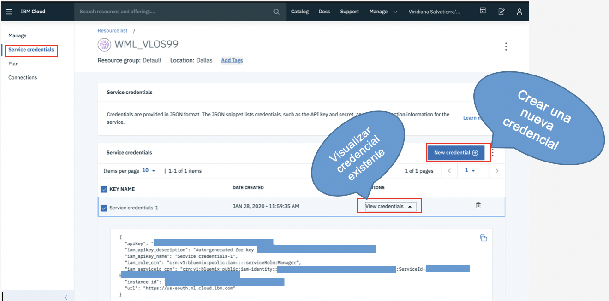
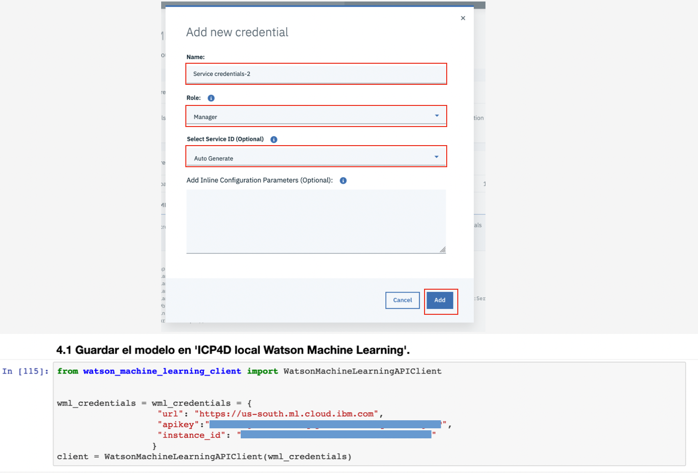
3.	Corremos la celda siguiente.
4.	En las siguientes dos celdas (4.2 y 4.3), cambiamos los valores “project_id” y “Access_Token” por nuestros valores. Para obtener el “Project ID”, simplemente vamos al “Overview” de nuestro projecto y copiamos, del “URL” dicho ID.

5.	Ahora, para obtener el “Access Token”, vamos a la pestaña de “Settings”, buscamos el apartado de “Access Token” y damos clic en “New Token”.
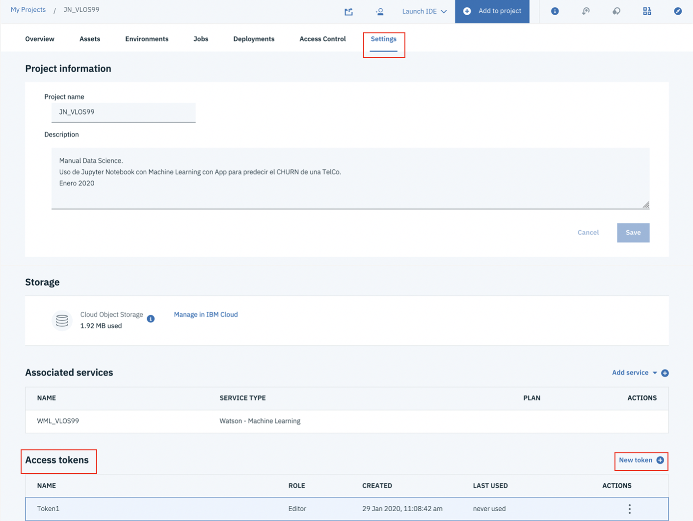
6.	Para crear nuestro “Token”, le vamos a dar un nombre que identifiquemos fácilmente, y en el apartado de “Access role for project”, seleccionamos la opción de “Editor” y damos clic en “Create”.
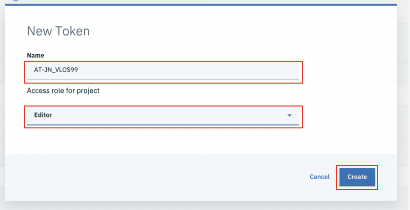
7.	Hecho esto, vamos a dar clic en el menú de “hamburguesa” (aparece al pasar el mouse sobre él) y seleccionamos la opción “view”.
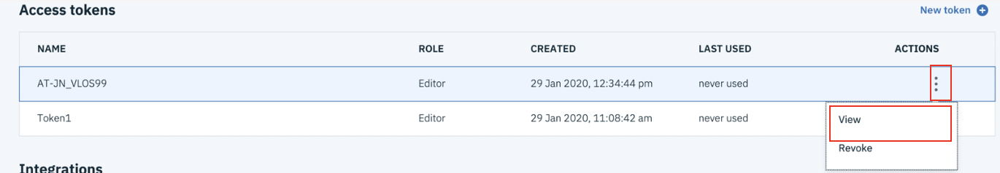
8.	Ahora copiamos el valor del token y lo reemplazamos en nuestra Jupyter Notebook, así como con el valor de nuestro “project ID” en las celdas de los apartados 4.2 y 4.3 de nuestra “Jupyter Notebook”
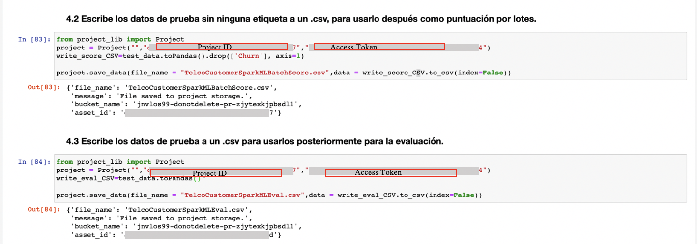
9.	Hecho esto ya habrás terminado de crear tu modelo.

[url-academic]: https://my15.digitalexperience.ibm.com/b73a5759-c6a6-4033-ab6b-d9d4f9a6d65b/dxsites/151914d1-03d2-48fe-97d9-d21166848e65/home/
[img-ibmcloud-powered]: https://img.shields.io/badge/IBM%20Cloud-Powered-blue.svg
[url-ibmcloud]: https://www.ibm.com/cloud/

Y listo! Puedes continuar con el siguente lab.

Te invitamos a explorar otros talleres y manuales en el siguiente enlace de Github.
https://github.com/ibmdevelopermx

